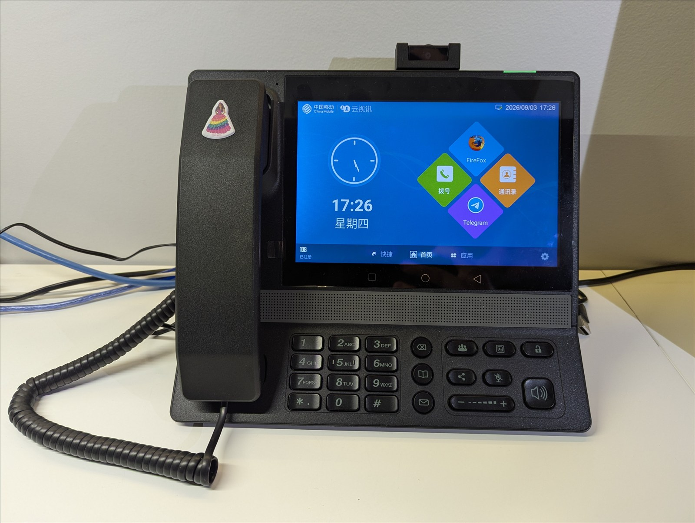
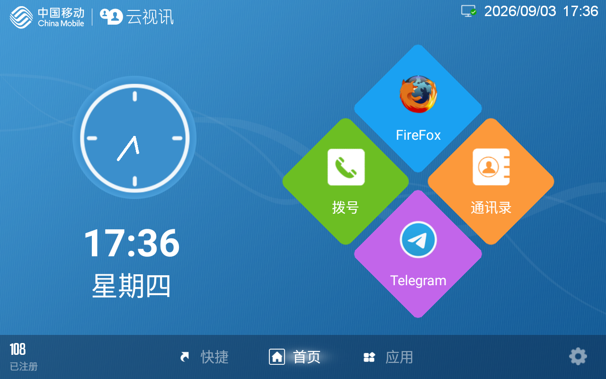
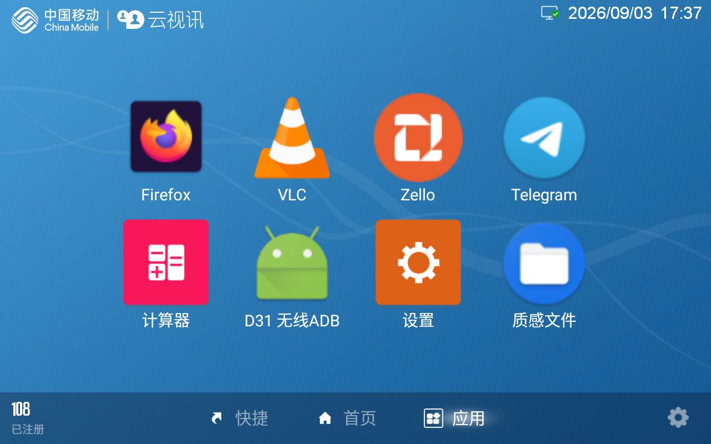
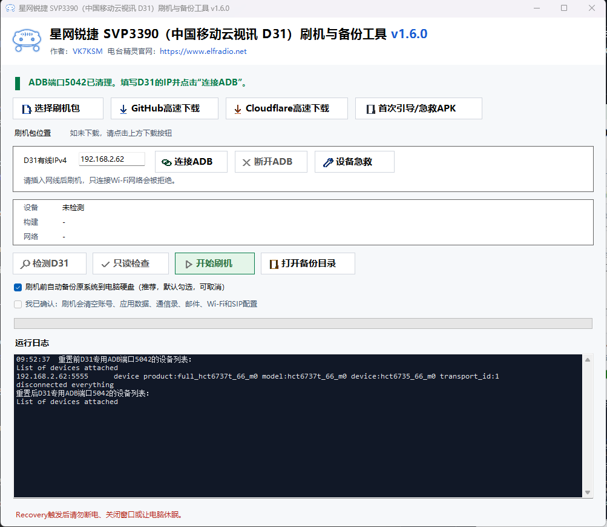
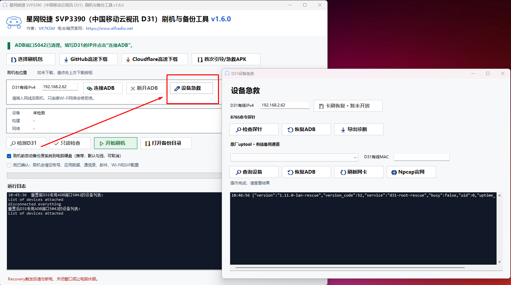

# China Mobile D31 / Star-net SVP3390 Firmware and Windows Flash Tool

[中文说明](README.md)

## What this project is

This is an ad-free international firmware package for the China Mobile D31. It comes with Telegram, Firefox, the Thunderbird email client, and Zello. The package also hardens the phone's Android 6 system against the malware, viruses, and remote attacks that can exploit an old Android release.

I developed this custom system to turn a retired high-end business phone into a communications terminal for the home. It gives children and older family members a simple way to communicate without handing them a smartphone. A desk phone is a communications device in its purest form, and the D31 is especially well suited to the job: it has a high-quality 8-inch display, native IP telephony and video calling, and becomes a proper enterprise-grade internal phone once a SIP line is configured. It is much simpler and more convenient than arranging every video call through WeChat. For a mobile companion, I also customized another piece of electronic waste, the [China Mobile D22 public-network radio](https://github.com/VK7KSM/ChinaMobile-D22), for children and older family members to carry when they go out.

I found this brand-new D31 on Xianyu for only RMB 220, and a lightly used D22 for just RMB 80. The whole family has had a great time with them.



## Hardware

- Product: China Mobile Cloud Video D31 / Star-net SVP3390 video phone
- Manufacturer: [Fujian Star-net Communication Co., Ltd.](https://www.smart-china.com/)
- Product page: [SVP3390 Unified Communications Video Phone](https://www.smart-china.com/productinfo/1453527.html)
- Hardware model: `SVP3390`
- Android platform name: `hct6737t_66_m0`
- Operating system: Android 6.0, API 23
- Security patch level: `2017-07-05`
- SoC: MediaTek MT6737T
- Memory: approximately 2 GB; the reference unit reports `MemTotal: 1,959,528 kB`
- Internal storage: approximately 16 GB; this build has a 13,517,717,504-byte `userdata` partition
- Expansion: microSD/TF card, up to 256 GB according to the manufacturer
- Display: 8-inch capacitive multi-touch panel, 1280 x 800 at 213 dpi
- Networking: two 10/100/1000 Ethernet ports, PoE, dual-band Wi-Fi, and Bluetooth 4.0+EDR
- Ports: two USB 2.0 host ports, HDMI, 3.5 mm audio, and an RJ9 handset connector
- Telephony: up to four SIP accounts, H.264 and VP8 video, up to 720p at 30 fps
- Build ID: `full_hct6737t_66_m0-userdebug 6.0 MRA58K 1583081804 test-keys`
- Build fingerprint: `alps/full_hct6737t_66_m0/hct6737t_66_m0:6.0/MRA58K/1583081804:userdebug/test-keys`
- Android product properties: `ro.product.name=full_hct6737t_66_m0`, `ro.product.device=hct6735_66_m0`

## Manuals

- [SVP3390 Product Brief](manuals/SVP3390_产品资料.pdf): a four-page overview of the hardware, interfaces, codecs, networking, and physical specifications.
- [SVP3390 User Guide](manuals/SVP3390_用户指南.pdf): the complete 96-page manual covering calls, contacts, video, physical keys, web configuration, and maintenance.
- [Source and checksum information](manuals/README.md)

## What is included

- The stock Nexui phone launcher, SIP audio/video client, dialer, incoming-call screen, contacts, blacklist, call recording, gallery, Chinese keyboard, calculator, Android Settings, and System WebView remain available.
- The original four-account SIP implementation, H.264/VP8 video, handset, speakerphone, HDMI, Ethernet, Wi-Fi, Bluetooth, and USB host support are preserved.
- Firefox 142.0, VLC 3.7.1, Zello 5.30.1, Telegram 12.10.1, Thunderbird 22.0, Messages 0.3.0, and the D31 File Manager 1.7.4-d31.2 are preinstalled without user accounts.
- [D31系统支持1.0.2、独立8765守护1.11.5与外置存储](docs/D31-v1.4.0与Recovery入口.md#本次更新)
- Zello stays online in the background. Direct and channel voice messages wake the display and bring Zello forward; after roughly five minutes without interaction, the phone returns to the stock launcher.
- The defunct Video Conference and Voice Conference tiles now open Firefox and Telegram. The boot patch also stops conference processes started before the patched package is mounted, preventing those tiles from falling back to the original conference screens.
- The orange tile on the stock home screen now opens the dual-channel Messages application. The application page contains Firefox, VLC, Zello, Telegram, Calculator, D31 Wireless ADB, Settings, and File Manager. Pressing `#` eleven times opens the application-page configuration menu.
- The stock analogue clock no longer assumes China Standard Time and now follows the Android time zone.
- The stock SIP client no longer forces TLS 1.0. It can negotiate TLS 1.2 with current SIP servers, and stale TLS sessions are cleared after a network change so SIP registration can recover. The fix has been verified with a successful TLS registration and a real incoming call.
- [启动交接、自动短信取号禁用及蜂窝VoLTE验收边界](docs/D31-v1.4.0与Recovery入口.md#本次更新)
- The package includes the dynamic IPv4/IPv6 inbound firewall, port 5555 ADB recovery at boot, the port 8765 status probe, and their boot integration as validated on the reference device.
- Live wallpapers, screen-saver assets, MediaTek engineering tools, logging utilities, and factory diagnostics are retained.

### System interface

| Nexui home screen | Application screen |
| --- | --- |
|  |  |

### Removed software

- **The worst junk of the lot:** Xuexi Qiangguo and WPS Office.
- The obsolete stock browser, i-jetty service, HTML Viewer, and music player.
- Bluetooth MIDI, AOSP Quick Search Box, the old Exchange service, and the preinstalled Baidu location service.
- The AOSP/MediaTek calendar application, calendar provider, and calendar importer.
- TR-069, its proxy service, the EMU carrier messaging component, abandoned conference-login services, and OMACP.

## Physical key assignments

| Key | Standby or normal application | Stock SIP audio/video call |
| --- | --- | --- |
| Envelope | Open Thunderbird | Suppressed so email cannot take over the call |
| Three people | Open Telegram | Suppressed so Telegram cannot take over the call |
| Three nodes | Open Firefox | Passed back to the SIP interface for screen sharing |
| Address book | Open File Manager | Suppressed so the file manager cannot take over the call |
| Layout | Open Android Recents | Passed back to the SIP interface for video layout control |

## Downloads

### GitHub

- [D31-Flash-Tool-v1.6.1.exe](https://github.com/VK7KSM/ChinaMobile-D31/releases/download/tool-v1.6.1/D31-Flash-Tool-v1.6.1.exe): the complete Windows utility, including the GUI, ADB, optional PC-based system backup, signed Recovery rescue launchers, instructions, bootstrap APKs, and the aria2 1.37.0 download engine. The 1.35 GB firmware is downloaded separately. It supports explicit ADB connection and disconnection, device checks before downloading firmware, multiple D31 phones selected by IP, Chinese Windows paths, accelerated GitHub and Cloudflare downloads, live throughput and ETA, resume support, and automatic single-connection fallback. The utility uses the dedicated D31 ADB server port 5042 and does not interfere with Pixel 3 on 5041 or H13 on 5038.
- [D31_SVP3390_Factory_Flash_v1.4.0_testkey.zip](https://github.com/VK7KSM/ChinaMobile-D31/releases/download/v1.4.0/D31_SVP3390_Factory_Flash_v1.4.0_testkey.zip): the 1.35 GB signed Recovery package. Version 1.4.0 keeps the complete, physically cleaned system image and includes dynamic USB/TF storage handling, the customized file manager, dual-channel messaging, corrected boot ordering, the Thunderbird ART workaround, and the cellular calling display fix.

### Cloudflare R2 mirror

- [D31-Flash-Tool-v1.6.1.exe](https://cdn.elfradio.net/d31/D31-Flash-Tool-v1.6.1.exe)
- [D31_SVP3390_Factory_Flash_v1.4.0_testkey.zip](https://cdn.elfradio.net/d31/D31_SVP3390_Factory_Flash_v1.4.0_testkey.zip)

### SHA-256

```text
0053D77FE49C1E10E609B8B325FF95DE91D84C46F49E85EB66EFA07F4B6365ED  D31-Flash-Tool-v1.6.1.exe
B8ACAE60874313F3220D53B04B378FC45F06CA11105DC53B3B1385AB725792E9  D31_SVP3390_Factory_Flash_v1.4.0_testkey.zip
```

## Preparing a factory D31

The two USB-A sockets are known to operate as host ports. They cannot currently be used as a USB device connection to a PC, so the flash utility communicates with ADB over Ethernet. Do not flash over Wi-Fi: disable Wi-Fi on the D31, connect Ethernet, and use a Windows 10 or newer PC.

1. Test the unmodified phone first. Confirm that it boots normally and that the display, touch panel, camera, Wi-Fi, Ethernet, handset, speakerphone, and SIP client all work.
2. Enter the factory password `10086` to open Advanced Settings and enable the wired network.
3. Open the dialer. Dial `*#223#*` and press the green call key to open the stock Android launcher. Dial `*#233#*` and press the green call key to open Android Settings directly.
4. If Developer options is hidden, open About device and tap Build number seven times. Enable USB debugging. This enables the Android debugging service; the transport still runs over the network.
5. Enable Unknown sources under Android Security, then pair the D31 with the Windows PC over Bluetooth.
6. 点击Windows工具的“首次引导/急救APK”取得内置文件，或单独下载[D31-wireless-adb-v1.11.5.apk](tools/D31-wireless-adb/D31-wireless-adb-v1.11.5.apk)，在Windows运行`fsquirt`发送到D31。[使用说明与源码](tools/D31-wireless-adb/README.md)。
7. Leave the D31 on the stock Android launcher opened with `*#223#*`. Accept the transfer from the notification shade and install the received APK with Android's native package installer.
8. Tap Open after installation, then tap the button that enables wireless ADB on port 5555. The application name says wireless ADB, but the same TCP port is reachable over Ethernet.
9. Find and note the D31's wired IPv4 address in the router or the phone's Advanced Settings.

## Flashing procedure



1. 下载`D31-Flash-Tool-v1.6.1.exe`，不需要解压，运行依赖和新版APK已内置。
2. Run `D31-Flash-Tool-v1.6.1.exe`.
3. Enter the D31's IP address and select Connect ADB. The address is not discovered automatically: when several D31 phones are present, enter the address of the unit you want to manage. A successful connection identifies the phone immediately. Detect D31 refreshes its status, while Disconnect ADB releases the current phone before switching to another one.
4. Select Read-only check. The firmware package does not need to be downloaded first. This step checks the device, root access, build, network, partition layout, Recovery entry point, available space, and dependencies without modifying or restarting the D31. A Wi-Fi address can be used for connection and read-only checks, but not for flashing.
5. Select Choose firmware package to use a ZIP already downloaded to the PC, or select GitHub accelerated download or Cloudflare accelerated download. Public GitHub Release downloads do not require an account or token. GitHub uses up to eight connections and Cloudflare uses up to sixteen; these are upper limits rather than mandatory connection counts. If the host rejects or limits segmented transfers, the utility preserves the partial download and automatically continues in single-connection compatibility mode.
6. Wait for the 1.35 GB firmware package to pass both the fixed-length check and the built-in SHA-256 check. Device connection, the read-only check, and package selection may be completed in any order.
7. Before flashing, connect Ethernet and make sure the utility is connected to the address assigned to the D31's wired `eth0` interface. The data-wipe confirmation and Start flashing control are enabled only after the device check, package verification, and wired-address check have all passed.
8. Back up the original system to this PC before flashing is selected by default, but it is optional. If left selected, the utility saves this D31's original system under `D31备份` on the PC and then continues automatically. If cleared, the utility warns that no rescue package will be available and allows the flash to continue. No USB drive or TF card is needed for a normal flash.
9. Tick the data-wipe confirmation and select Start flashing. The D31 restarts automatically. Do not disconnect its power, press its physical keys, close the flashing utility, or allow the PC to sleep or shut down before the process finishes. On the first boot, Android rebuilds `userdata` and performs ART optimization, so the phone may run much more slowly than usual. This is normal.

## Recovering from a failed flash

If the D31 is stuck at the China Mobile logo or “Starting apps,” keeps restarting its launcher, or will not accept ADB connections, use the Windows tool to restore management access first. Do not repeatedly disconnect power or jump straight to a factory reset. **Restoring ADB does not repair the system by itself**; it lets you collect diagnostics and address the fault.

### Windows工具1.6.1恢复ADB

1. Leave the D31 powered on and connect it and the PC to the same wired LAN. Internet access and a downloaded firmware package are not required.
2. Run `D31-Flash-Tool-v1.6.1.exe`, enter the affected phone’s **wired IPv4 address**, and select **设备急救** (Device rescue), to the right of Disconnect ADB. This window is available even when ADB is disconnected.
3. Check the IP at the top of the rescue window. If you have several D31 phones, make sure you have selected the right one.



#### Try the port 8765 command probe first

1. In the upper section, select **检查探针** (Check probe).
2. If it returns the probe version and a status including `uid=0`, select **恢复ADB** (Restore ADB) in that same section and confirm.
3. The tool briefly stops and starts adbd on the D31, sets its port to 5555, clears the PC’s dedicated port 5042 connection, and then connects to and identifies the phone. **Success means the log confirms an ADB handshake and D31 identification**, not just that a command was sent.
4. Use **导出诊断** (Export diagnostics) to save read-only status information to the PC. Close the rescue window, select Connect ADB in the main window, and continue with detection and the read-only check.

This route requires `D31-wireless-adb-v1.11.5.apk` to have been installed on the D31 and **启用开机救援（8765）** (Enable boot rescue) enabled before the failure. Having the APK on the PC, or installing it without enabling boot rescue, does not guarantee that the probe will be available during a failed boot.

#### If the probe is unavailable, use the factory uptool service

1. Install [official Npcap](https://npcap.com/#download) on the PC. The rescue window’s **Npcap官网** button opens its website; select **刷新网卡** (Refresh adapters) after installation. **Python and a separate ADB installation are not needed; ADB is bundled with the tool.** If Npcap was restricted to administrators, run the tool as administrator.
2. In the lower section, select the PC’s Ethernet adapter connected to the D31 and enter the affected phone’s **wired MAC address**. Do not use the PC’s MAC or the D31’s Wi-Fi MAC. Check the phone’s network settings, device label, or a trusted network-neighbor record.
3. Select **查询设备** (Query device). After receiving a valid response from the target, select **恢复ADB** (Restore ADB) in the lower section and confirm.
4. The tool queries that MAC again, sends the fixed ADB recovery command, and attempts an actual connection to the IP entered above. Again, **the ADB handshake and D31 identification must pass**; “sent” alone is not a success result.
5. Close the rescue window and connect from the main window to investigate the fault. If recovery fails, keep the log and check the adapter, IP, and MAC instead of repeatedly reflashing.

uptool requires the PC and D31 to share the same wired Layer 2 network. An ordinary Internet connection, routed connection, or VPN is not a substitute. The D31’s kernel, Ethernet driver, and factory service must still be running, but its launcher and the port 8765 probe need not be available.

**Restore ADB does not flash partitions, erase user data, reboot the phone, or start a firmware installation.** The PC uses only the D31’s dedicated ADB server on port 5042 and leaves other devices’ servers alone. Diagnose first: Start flashing is a separate operation that erases data.

Third-party tools or scripts can also call uptool. Manual use is an alternative covered in the [command reference](docs/D31-uptool指令与安全说明.md); the graphical workflow above is the recommended route and does not require a command line.

### Recovery

[1.4.0：音量加激活Recovery，音量减移动，免提确认；操作步骤和适用条件](docs/D31-v1.4.0与Recovery入口.md#使用音量加键进入recovery)

### Limits and security

- [1.4.0固件、1.6.1工具：更新内容、数据清除及分区写入范围](docs/D31-v1.4.0与Recovery入口.md)
- Neither rescue channel guarantees recovery when the bootloader or kernel cannot start. See the [Windows rescue guide](docs/D31-Windows工具急救.md) for the test scope.
- The development probe and the tested factory uptool service allow root commands without a password. Use a trusted maintenance network and do not expose ports 5555 or 8765 to the Internet. uptool uses raw Ethernet frames, so ordinary TCP/UDP filtering does not establish that it is blocked. See the [security guidance](docs/D31-uptool指令与安全说明.md).

## A final note

The firmware and flashing utility were built in about a week with help from Codex, Antigravity, Cursor, Claude, and other AI-assisted development tools. It works, the family enjoys it, and that is the point.
