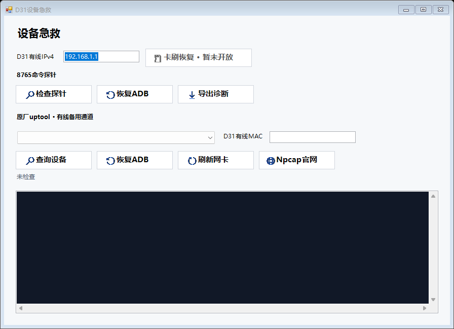

# D31 Windows工具急救

## 下载与启动

- [GitHub下载1.6.0](https://github.com/VK7KSM/ChinaMobile-D31/releases/download/tool-v1.6.0/D31-Flash-Tool-v1.6.0.exe)
- [Cloudflare下载1.6.0](https://cdn.elfradio.net/d31/D31-Flash-Tool-v1.6.0.exe)
- SHA-256：`7A264BFB0B70EBAEBCD24D1BBC36536A02D760952591F53802908D6B2C9C42BE`

双击EXE即可运行，不需要解压或另外下载ADB。点击“首次引导/急救APK”会打开自动释放的文件夹，其中包含`D31-wireless-adb-v1.11.0.apk`。通过蓝牙或U盘传到D31，覆盖安装旧版，不要先卸载。完整固件仍另行下载，本轮没有更新固件。

## 设备急救入口

“设备急救”位于主窗口“断开ADB”右侧。无需先连接ADB，也无需先下载刷机包。弹窗继承主窗口填写的IP，可修改；有多台D31时须确认目标，工具不会替用户任选一台。

上图是使用示例地址渲染的窗口，不含真实设备或网卡信息。

## 优先使用8765

1. D31已经安装新版无线ADB应用，并在应用中启用了“开机救援（8765）”。
2. 输入D31有线IP，点击“检查探针”。即使桌面尚未启动或ADB已停止，独立命令服务运行时仍可响应。
3. 点击“恢复ADB”，确认后工具短暂停启adbd，将设备端口设为5555，等待服务启动，再清理电脑专用5042连接并重新握手。
4. 以日志中的实际握手与D31识别结果为准，不以“命令发送成功”判定恢复完成。
5. “导出诊断”保存启动完成标志、adbd状态、空间和相关进程等有限只读结果到电脑，不读取账号配置或完整通信日志。

## 备用uptool通道

1. 电脑和D31连接同一有线二层网络，不需要互联网；跨路由器、普通VPN不能替代这一条件。
2. 电脑安装[官方Npcap](https://npcap.com/#download)。EXE没有内嵌驱动安装器，也不需要Python。若安装时限制为管理员访问，须以管理员身份运行工具。
3. 选择电脑连接D31的有线网卡，填写D31的**有线MAC**，不要填Wi-Fi MAC或电脑MAC。可从设备网络设置、机身标识或可信的网络邻居记录核对。
4. 点击“查询设备”；收到指定MAC的有效原厂设备信息后再点击“恢复ADB”。每次恢复也会重新做一次定向查询，只向该MAC发送固定恢复命令。
5. 电脑侧同样使用5042服务实际连接输入的D31有线IP。若IP填写错误，即使目标MAC收到命令，也不能完成所期望设备的握手。

恢复操作不刷分区、不清除数据、不修改防火墙、不重启整机；只短暂中断目标D31的ADB。不会停止Pixel 3的5041或H13的5038。若普通连接已经正常，无需点击恢复。

## 卡刷与能力边界

“卡刷恢复 · 暂未开放”仅为禁用入口，没有实现卡刷、制作启动卡或进入Recovery功能。本次未研究新的Recovery入口，也没有执行真实刷写。

8765依赖内核、data及救援启动链；uptool依赖内核、有线驱动和原厂进程。两者都不能保证在引导器或内核无法启动时救援，也不会自动修复所有桌面故障。

**完整刷机可能覆盖旧启动链并清空data，因此不能假设刷机前启用的8765会一直保留。** 当前独立固件仍为1.3.0，含其原有版本应用。刷后应重新检查新版APK和开机救援状态，必要时从工具释放目录覆盖安装1.11.0并重新启用；本次工具更新没有改写固件包。

## 验收与安全

2026年9月7日，最终1.6.0 EXE通过24项协议检查、默认及最小窗口尺寸检查、原有刷机包和下载解析检查；在本机D31上分别确认adbd停止，再通过8765和uptool恢复，并取得有线root ADB连接。最终系统启动完成、adbd正常运行。窗口图来自控件渲染验收，不是完整高DPI或多台设备测试。

修复了原厂uptool将最高位为1的会话号视为负数而拒绝的问题；当前只生成正整数会话号，保留重复会话规避。两条通道均不以发包成功代替实际ADB握手。

开发版8765及原厂uptool没有密码保护，同局域网的不可信设备可能执行root命令。只在可信维护网络使用，不把8765、5555暴露到公网；uptool使用原始以太网帧，普通TCP/UDP端口过滤不能证明已阻断它。详见[原厂指令与风险](D31-uptool指令与安全说明.md)。本轮未关闭救援通道或增加设备白名单。
